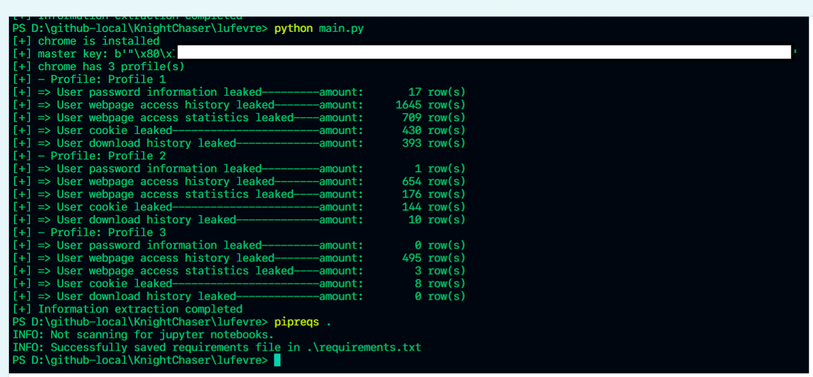
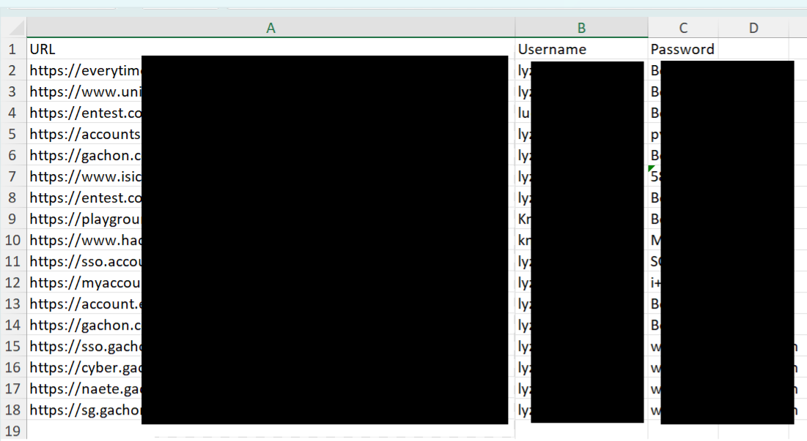
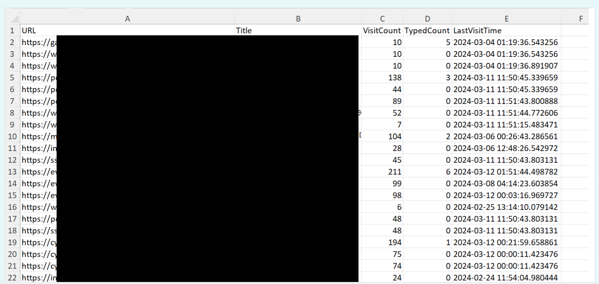
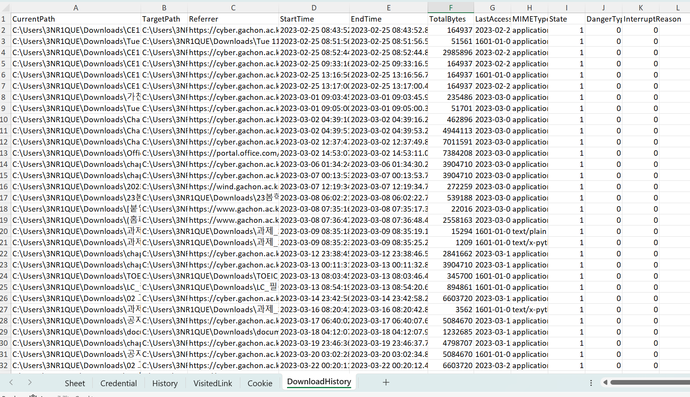

# lufevre
### A simple and fast Chrome browser information stealer

This program is designed to steal information from the Chrome browser. It is a lightweight and efficient tool that can quickly gather various types of data from the target system.

## Features
- **Website login credentials(ID/PW):** `lufevre` can extract and collect login credentials (username and password) used for various websites accessed through the Chrome browser.
- **Website access history:** `lufevre` can retrieve the browsing history of websites visited using the Chrome browser, providing a chronological record of the user's online activities.
- **Website access statistics:** `lufevre` can generate statistics on website access, including the frequency of visits, duration of visits, and timestamps of the last visit.
- **Website cookies:** `lufevre` can capture and store cookies associated with websites visited using the Chrome browser, allowing for potential session hijacking or unauthorized access.
- **Browser download history:** `lufevre` can retrieve the download history of files obtained through the Chrome browser, providing insights into the user's file download activities.

- Any protected information by Chrome's encryption logic will be decrypted by `lufevre`(Even if you don't know the password of the victim's device), Chrome/Webkit timestamp will be converted to human-readable time format automatically.
- lufevre supports multiple profiles in the browser and the extracted information will be exported as excel files; `{PCName}_{BrowserName}_{Profile}.xlsx`.

## Preview

## Usage
To use lufevre, follow these steps:
1. Clone the repository: `git clone https://github.com/KnightChaser/lufevre.git`
2. Install the required dependencies: `pip install -r requirements.txt`
3. Run the program: `python lufevre.py`

Please note that using this program for unauthorized activities is illegal and unethical. Make sure to comply with all applicable laws and regulations.

## Disclaimer
Please note that the use of `lufevre` for unauthorized activities is illegal and unethical(You might know if it is.). Ensure compliance with all applicable laws and regulations. Use this at your own risk.